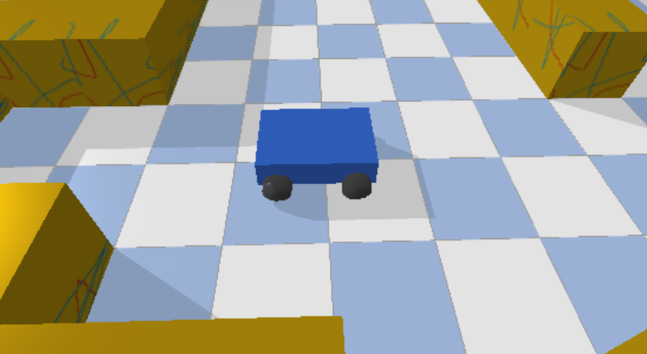
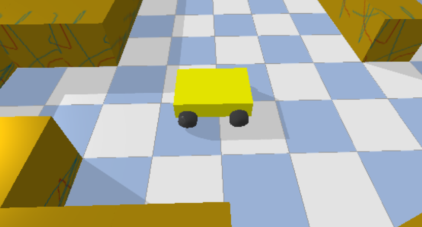
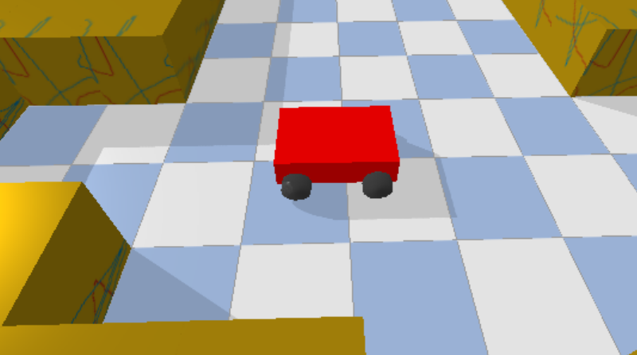
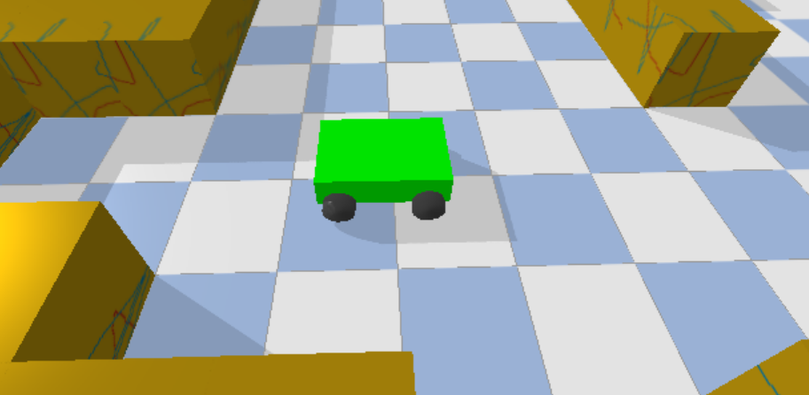
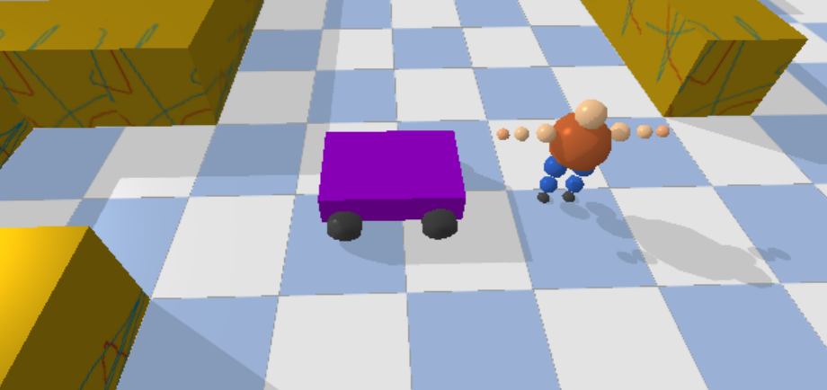

# Autonoma system A1F - Case Study

This project demonstrates a proof-of-concept simulation of an Autonomous Mobile Robot (AMR) designed to improve warehouse automation. The implemented solution supports supervised operation modes such as predefined task execution, route following, and safe stopping to avoid human collisions, allowing it to accommodate the operational requirements of both warehouse scenarios.

## Get Started

**Requirements:**
- Python 3.11.9 (different versions might work)

**Setup:**
```
python -m venv .venv
```

Linux /MacOS:
```
source .venv/bin/activate
```

Windows:
```
.venv\Scripts\activate
```

Dependencies:
```
pip install pybullet
pip install -r requirements.txt
```

**Run Simulation:**
```
python main.py
```

## Modes & Controlls

| Modes     | Key | Description        |
|-----------|-----|---------------------------------------------|
| CAMERA    | C   | use the camera to move around in simulation | 
| ROBOT     | R   | cycle through Robots |
| HUMAN     | H   | cycle through Humans |
| Exit| SPACE | Exit the Program |
|Simulation| G | Replays all Robot Tasks |

*Note - When switchen from ROBOT to HUMAN/CAMERA:*
- Replay keeps going
- Recording is paused
- Manual Control is stopped (Sleep)

### Camera Conntrols

| Key               | Action       |
|-------------------|--------------|
| Arrow Keys        | Pan camera (when not following a robot)  | 
| PageUp / PageDown | Zoom in / out |
| O / P             | Rotate camera yaw  |
| U / I             | Rotate camera pitch      |

### Human Controls

| Key      | Action      |
|----------|-------------|
| W/A/S/D  | Move around |
| H        | Cycle through humans |


### Robot Controls

| Key       | Action        |
|-----------|---------------|
| W/S       | Drive Stright | 
| A/D       | Spin in Place |
| R         | Cycle through robots (select next robot) |
| 1         | Record Task  |
| 2         | Do Task      |
| F         | Toggle camera follow mode (follows selected robot)|
| L         | Show LIDAR debug lines (only in replay mode)      |


**Color Coding of Robot:**
|Condition	       | Color        |
|------------------|--------------|
|Recording         | Red          |
|Replaying         | Green        |
|Selected (manual) | Yellow       |
|Sleeping / Not selected | Blue   |
| Human detected (only in replay mode)| Purple |

## Examples

## Warehouse


## Task Simulation Video


## Robot Colors

**Sleep**


**Selected**


**Recording**


**Replaying**


**Human Detected during Task Replay**


## Notes
- Replay is currently not accurate